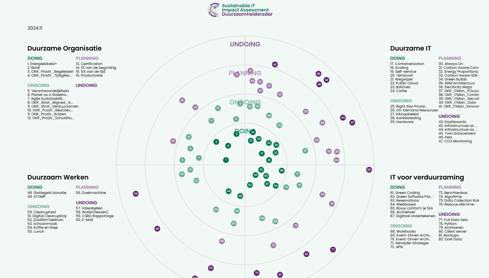

# De duurzaamheidsradar van het Sustainable IT Impact Assessment (SIIA)
Welkom bij de [SIIA Radar](https://radar.ncdd.nl), onderdeel van [SIIA](https://coalitieduurzamedigitalisering.nl/sustainable-it-impact-assessment-siia/), het sustainable IT Imapact Asessment van de Nationale Coalitie Duurzame Digitalisering! Deze radar is gevuld met activiteiten om een organisatie te verduurzamen. Het overgrote merendeel van de activiteiten en beschrijvingen is afkomtig van het werk van [WiGo4IT](https://www.wigo4it.nl). En heeft als doel om de  huidige positie van de organisatie op het gebied van duurzaamheid inzichtelijk te maken en tegelijkertijd bewustwording te creëren.

## Doelstellingen:
- *Inzicht in huidige positie*: De radar biedt een visueel overzicht van de  voortgang en prestaties op verschillende duurzaamheidinspanningen.
- *Bewustwording*: Door  duurzaamheidsinspanningen transparant te delen, willen we zowel intern als extern bewustzijn en betrokkenheid vergroten.

## Visuele weergave 
Deze intuïtieve en interactieve radar toont de  sterke punten en aandachtspunten. De radar fungeert als een hulpmiddel voor continue verbetering door periodieke updates en betrokkenheid van medewerkers en management.

## Hoe te gebruiken:
De code voor deze radar is open-source en beschikbaar op GitHub. U kunt de code downloaden, aanpassen en gebruiken om uw eigen duurzaamheidsinitiatieven te evalueren en te verbeteren. We nodigen u uit om bij te dragen aan dit project door suggesties, verbeteringen en nieuwe ideeën te delen.

Samen kunnen we werken aan een duurzamere toekomst. Bedankt voor uw interesse en bijdrage aan de Duurzaamheidsradar van Wigo4it!

# Duurzaamheidsradar Licentie

Duurzaamheidsrecht (🌱) 2024 WIGO4IT

Je mag deze software gebruiken, kopiëren, aanpassen, verspreiden en delen met iedereen die je kent, zolang de enige winst een duurzamere wereld is. Onze missie is simpel: inspireer mensen om duurzamer te leven. 

De software wordt geleverd “zoals hij is”, zonder enige garanties. Als je energieverbruik of bloeddruk stijgt door het gebruik van onze software, neem dan een kopje fair trade koffie of thee. Gebruik het op eigen risico en het liefst met een glimlach! 

Geniet van de duurzaamheidsradar en laten we samen de wereld een beetje groener maken!

*Deze radar is gebaseerd op de TechRadar van [ThoughtWorks](https://www.thoughtworks.com/radar) en [Zalando](https://github.com/zalando/tech-radar). Bedankt voor hun inspiratie en geweldige werk!*
=======
